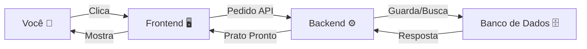

# Arquitetura do Sistema 🏗️

Vamos entender como as peças se encaixam. Imagine um **Restaurante**.

## 1. O Frontend (O Salão e os Garçons) 🍽️
O **Frontend** é tudo o que você vê na tela.
*   É onde estão os botões, as cores e os textos.
*   Ele é feito com **React**.
*   Quando você clica em "Salvar", o Frontend anota seu pedido e leva para a cozinha.

> **Analogia**: O Frontend é o garçom. Ele te atende, mas não cozinha a comida.

## 2. O Backend (A Cozinha) 👨‍🍳
O **Backend** é onde a mágica acontece, mas você não vê.
*   Ele recebe o pedido do Frontend.
*   Ele verifica se você tem permissão (Se pagou a conta!).
*   Ele cozinha (processa os dados) e guarda na geladeira (Banco de Dados).
*   Ele é feito com **Node.js** e **Fastify** (Fastify é como um chef muito, muito rápido).

## 3. A Comunicação (API) 🗣️
Como o Garçom fala com a Cozinha?
*   Eles usam uma linguagem padrão chamada **API REST**.
*   **GET**: "Me dê o cardápio" (Buscar dados).
*   **POST**: "Aqui está um novo pedido" (Criar dados).
*   **PUT**: "Troque meu pedido" (Atualizar dados).
*   **DELETE**: "Cancele meu pedido" (Apagar dados).

## Diagrama Simples

